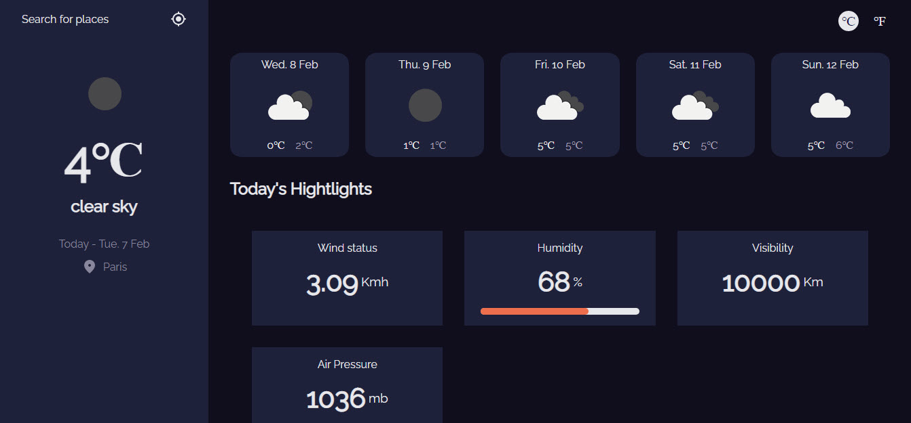

<h1 align="center">Weather Page</h1>

<div align="center">
  <h3>
    <a href="https://rodrigogzmn6-weather-page.netlify.app/">
      Demo
    </a>
    <span> | </span>
    <a href="https://github.com/Rodrigogzmn6/weather_page">
      Solution
    </a>
  </h3>
</div>

<!-- TABLE OF CONTENTS -->

## Table of Contents

- [Overview](#overview)
  - [Built With](#built-with)
- [Features](#features)
- [How to use](#how-to-use)
- [Contact](#contact)
- [Acknowledgements](#acknowledgements)

<!-- OVERVIEW -->

## Overview



This project recreates a page that shows the weather in your current location. You can also search for any city you want and you can change the units between metric and imperial using the "℃" and "℉" buttons.
This page is based in the use of contexts to retrieve all the information with an API call.

### Built With

<!-- This section should list any major frameworks that you built your project using. Here are a few examples.-->

- [React](https://reactjs.org/)

## Features

<!-- List the features of your application or follow the template. Don't share the figma file here :) -->

This application/site was created as a submission to a [DevChallenges](https://devchallenges.io/challenges) challenge. The [challenge](https://devchallenges.io/challenges/mM1UIenRhK808W8qmLWv) was to build an application to complete the given user stories.

## How To Use

<!-- Example: -->

To clone and run this application, you'll need [Git](https://git-scm.com) and [Node.js](https://nodejs.org/en/download/) (which comes with [npm](http://npmjs.com)) installed on your computer. From your command line:

```bash
# Clone this repository
$ git clone https://github.com/your-user-name/your-project-name

# Install dependencies
$ npm install

# Run the app
$ npm start
```

## Contact

- GitHub [Rodrigogzmn6](https://github.com/Rodrigogzmn6)
- LinkedIn [Rodrigo Isaac Guzman](https://www.linkedin.com/in/rodrigo-isaac-guzm%C3%A1n-99951418a/)
